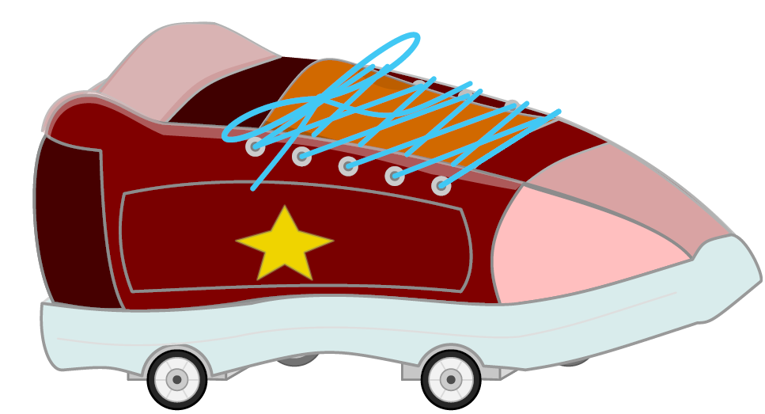

# sneaker — A configurable TikZ sneaker drawing

A LaTeX package that provides a highly configurable sneaker
illustration using TikZ. The shoe can be customised via a
key–value interface: colours, laces, velcro straps, eyelets,
decorative patterns (bolt or star), stitching, and rolling
wheels are all available as simple options.

<p align="center">
  
</p>


## Usage
```latex
\usepackage{sneaker}

\begin{tikzpicture}
  \pic{sneaker={color=red, laces=true, eyelets=true, stitching=true}};
\end{tikzpicture}
```

## Requirements

- LaTeX2e
- TikZ with library `calc`

## Key Features

The `sneaker` package offers a wide range of customization options to create everything from a simple icon to a detailed illustration.

### Modular Components
Every part of the shoe can be toggled to change the style of the sneaker:
*   **Laces & Bow:** Detailed shoelaces (best combined with eyelets).
*   **Velcro Straps:** Choose between a classic two-strap look or a hybrid lace-and-strap design.
*   **Metal Eyelets:** A row of circular eyelets for the lace zone.
*   **Detail Stitching:** Adds dashed seam lines to the upper panels and the sole for a realistic touch.
*   **Inline Wheels:** Transform the sneaker into a roller skate with three inline wheels (`rolls`).

### Design & Patterns
Add a unique look to the side panel with built-in decorative patterns:
*   **Bolt:** A dynamic lightning-bolt decoration.
*   **Star:** A classic five-pointed star icon.
*   **Custom Colors:** All patterns have their own color keys.

### Total Color Control
The package uses a "Smart Tinting" system. By default, parts like the tongue and toe cap are tinted based on your main color, but you can override every single part:
*   `color`: The primary base color.
*   `sole color`: Customize the rubber sole.
*   `lace color`: Change the color of the strings and the bow.
*   `toe cap color`: Highlight the front panel.
*   `tongue color`: Adjust the inner shoe tongue color.

### Technical Highlights
*   **Isometric Perspective:** The shoe is drawn in a stylised 3D-like view.
*   **TikZ Native:** No external images required—everything is rendered as pure vector graphics.
*   **Scalable:** Since it's a TikZ `pic`, it can be scaled, rotated, and styled within any `tikzpicture`.

## License

This material is subject to the LaTeX Project Public License, version 1.3c or later. The latest version of this license is at https://www.latex-project.org/lppl.txt. For more details see `sneaker-doc.pdf`.